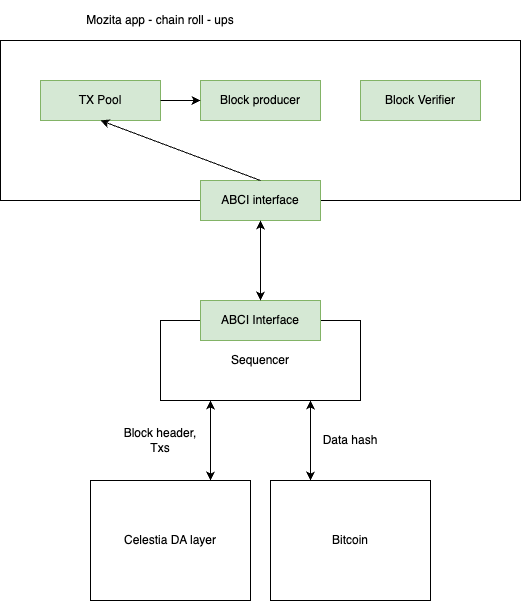

How would I submit blocks to Bitcoin?

# architecture overview



1. block producer
* produce blocks, then forward blocks to bitcoin

2. block verifier
* sequencer will fetch bitcoin blocks and then submit to block verifier (through ABCI)
* block verifier will then execute through all blocks to derive hash used for verification

# changes management
- [bitcoin client interface](../../da/bitcoin/bitcoin.go)
- [bitcoin node integration](../../node/bitcoin.go)
- [bitcoin client manager](../../block/manager.go)
- [bitcoin block store](../../block/bitcoin.go)

# bitcoin client
bitcoin client structure
```go
// BitcoinClient interacts with Bitcoin layer
type BitcoinClient struct {

}
```

interacts with bitcoin layer through functions:
* SubmitStateProofs
* RetrieveStateProofs
* MaxProofSize
* RetrieveBlocks

use btcd rpcclient to interact: https://github.com/btcsuite/btcd/tree/master/rpcclient

## Bitcoin transaction format
* `version`: indicate the current latest supported transaction version. It allows for protocol upgrades and changes to be implemented while maintaining backward compatibility with older versions of the transaction format. This field helps in distinguishing between different transaction formats and enables the network to evolve over time.
* `locktime`: specifies the earliest time or block height at which a transaction can be added to the blockchain. If the lock time is set to 0, the transaction can be included in the next block. If the lock time is in block height format, it indicates the specific block height at which the transaction can be included.
* `tx_in`: This field represents the transaction inputs. Each input refers to a previous transaction's output that is being spent in the current transaction. It includes information such as the previous transaction's hash, the index of the output being spent, the script that unlocks the funds, and the sequence number
* `tx_out`: This field represents the transaction outputs. Each output specifies an amount of Bitcoin and the conditions that must be met to spend that amount. It includes the value of the output (amount of Bitcoin), and the locking script that defines the conditions under which the funds can be spent.

## State proofs format
* Inscription data field has a limit of 520 bytes, if bigger then one has to create multiple inscription
* envelope format containing state proofs (state root hash, transactions hash to ensure transaction orderings)

```go
type ProofsEnvelope {
    block_header []byte
    txs_hash []byte
}
```

how Optimism implement their fraud proofs system?

# manager
manager is responsible for aggregating transaction hashs into bitcoin and keep track of bitcoin blocks

```go
type Manager struct {
    // interaction interface with bitcoin
    btc *bitcoin.BitcoinClient
	// btc_height is the height of the latest processed Bitcoin block
	btc_height uint64
}
```

manager responsibilities:
1. retrieve latest blocks from bitcoin `BtcRetrieveLoop` independently from DA block fetching
* every new block event will be pushed into btcBlockInCh channel for later processing

2. syncing bitcoin blocks `SyncLoop()`:
* retrieved bitcoin rollups block latest height is not guaranteed to be on the same height as blocks retrieved from DA layer
* proofs from bitcoin are used for verification, it needs to work along side block syncing. Block syncing process will fetch stored roll ups block to compare results
* btc roll ups block start from 1, bitcoin rollups proofs will be fetched into store for future verification
* **a separate btc roll ups proof store, maintaining along side block store**

3. submit proofs to bitcoin layer:
* track pending proofs to be submitted to bitcoin
* all bitcon proofs will be submitted as **best - effort** for now, thus no use of limiting proofs batch through MaxBlobSize
* manager will periodically publish blocks to bitcoin with two stages:
  * AggregationLoop: a loop to aggregate transaction data into a block, to be later pushed to bitcoin
  * BtcBlockSubmissionLoop: a loop to push btc blocks to bitcoin

mechanism understanding:
* how block syncing happens, why it has to stay together NewBlockEvent
* celestia uses ipfs block store to persist blocks
* rollkit fetches block stores `BlockStoreRetrieveLoop` and then feed it into a channel for later processing, but why only one `blockInCh`? 
* a block fetched from DA consists of many block stores from IPFS at exact da height
* a roll ups block will be persisted into block store through 
  * trying to catch up with blocks when syncing (trySyncNextBlock)
  * trying to aggregate newly created transactions into a new block (publishBlock)
* block persisted into block store will be later fetched by block submission loop to push those to bitcoin layer

# node integration
fullnode integration

```go
type FullNode struct {
    btc          *bitcoin.BitcoinClient
}
```